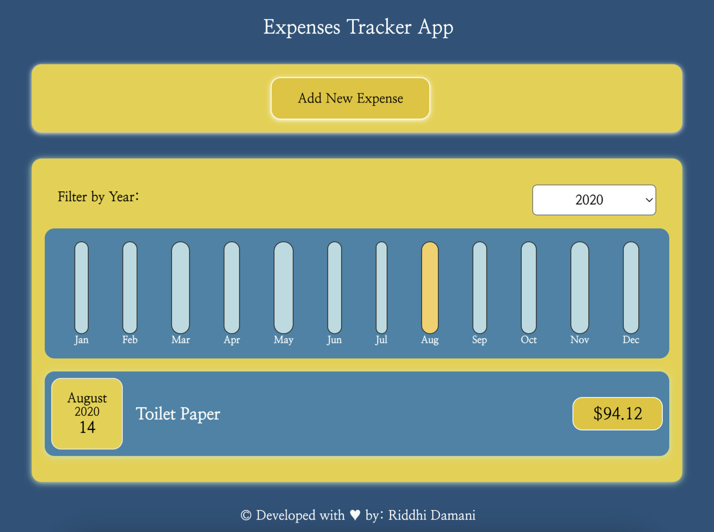
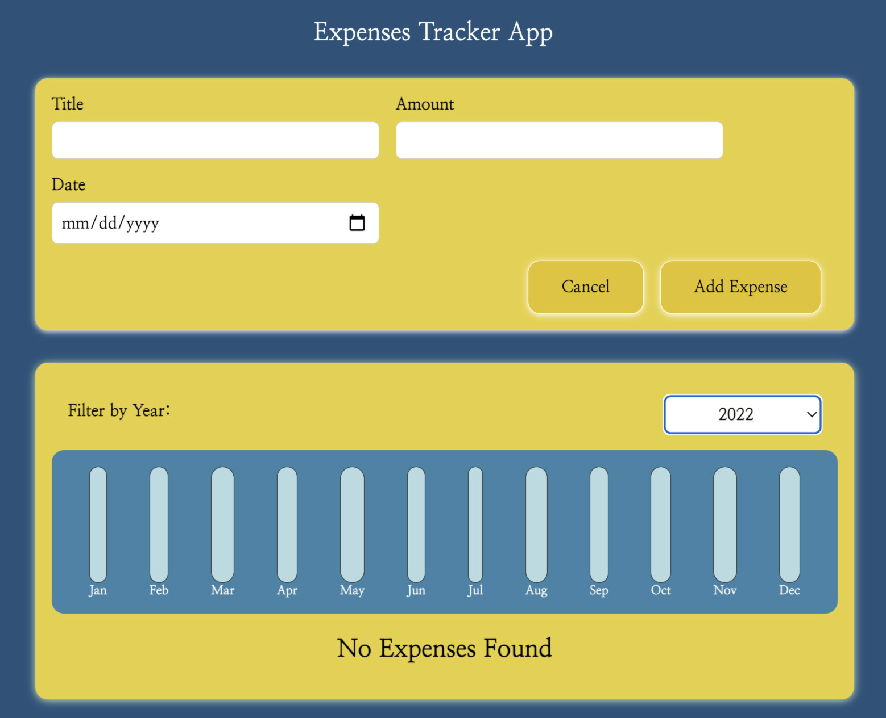
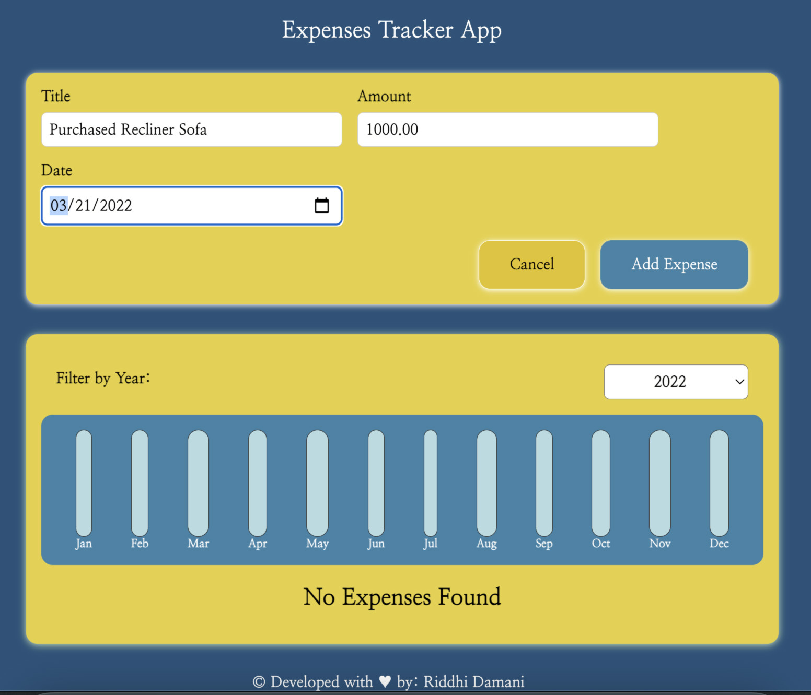
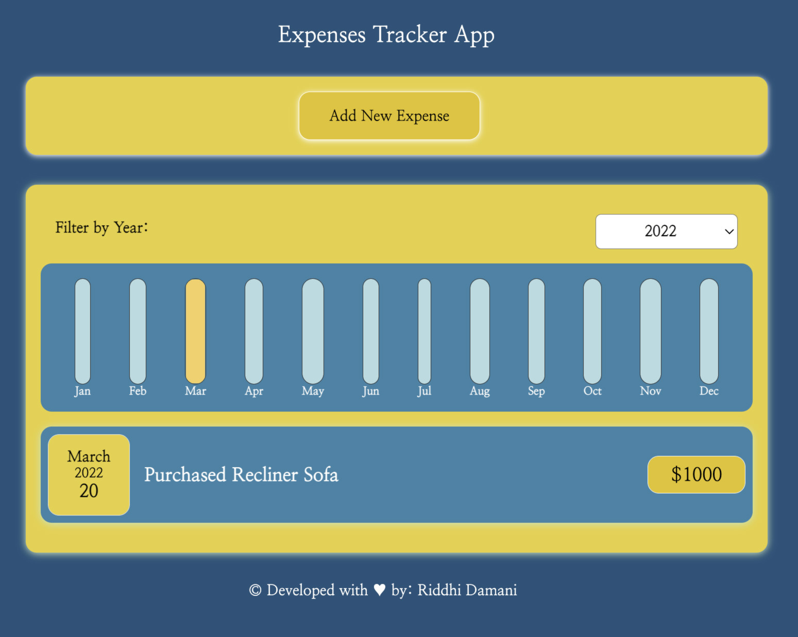

Expenses Tracker is a react based web app where in we can see our expenses - also by year. We can filter the expensed based on year we select and a graphical animation (Chart) will be displayed for the same. We can also add a new expense in this tracker.

Currently, the expenses are not stored in the database. This is a standalone basic react app showcasing knowledge gained in terms of react components and states.

## Demo - Deployed on Netlify

https://expenses-tracker-v01.netlify.app/

### Sample Screen Shots of App:

 

 

